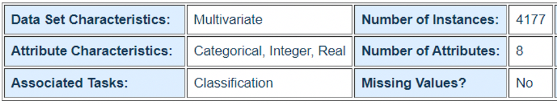
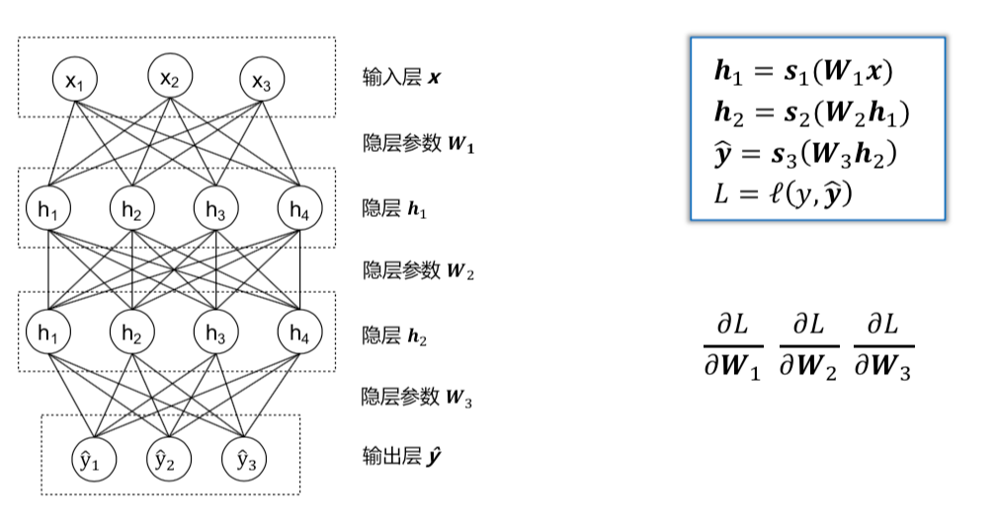
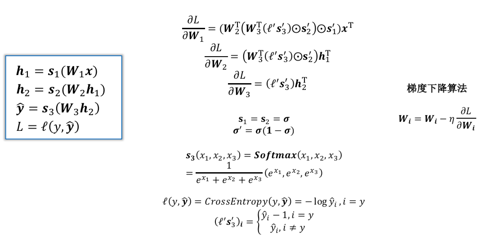
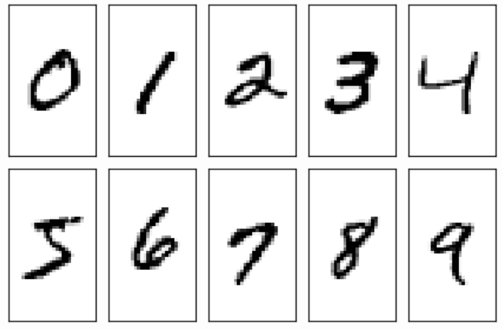
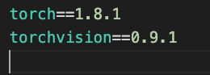

# 人工智能基础LAB2实验要求

==DDL：2021.7.xx 23:59:59==

## 1. 实验内容与提示

本次实验包含传统机器学习与深度学习两部分。

实验部分需要使用python=3.6，建议使用anaconda管理python环境，深度学习部分要求使用pytorch=1.8.1，torchvision=0.9.1完成（安装说明见https://pytorch.org，学习教程可以参考https://pytorch123.com），实验部分使用CPU足够训练，如果想体验GPU的速度可以使用colab。

**评分标准**

| 项目内容                     | 分值   |
| ---------------------------- | ------ |
| 线性分类算法                 | 2      |
| 朴素贝叶斯分类器             | 2      |
| SVM算法                      | 2      |
| 手写感知机模型并进行反向传播 | 3      |
| 复现MLP-Mixer                | 2      |
| 实验报告                     | 1      |
| 迟交或者不符合格式           | 倒扣分 |

## 2. 传统机器学习

在这部分，你需要根据鲍鱼的物理测量属性预测鲍鱼的年龄。

数据集：鲍鱼数据集

原数据地址：

http://archive.ics.uci.edu/ml/datasets/Abalone

大家可以在原数据地址上查看该数据集属性。

由于该数据的标签数较多(1-27,29),大部分类别的数目极少,在针对每个类别计算F1-score时TP,FP,FN常为0,影响计算,故仅保留了该数据集中label<=11的数据.在此基础上,为了使各类数据均衡,将原有的11个类按照[1,7],[8,9],[10,11]划分得到了新的三个类。

由于考虑到数据集划分的随机性，所以已经提前将数据集划分成了训练集 train_new.data和测试集 test_new.data。

我们在src1文件夹中提供以下文件：

-data

--train_new.data # 训练数据

--test_new.data # 测试数据

-process_data.py # 加载并处理数据集

-evaluation.py # 使用到的评价指标，包括准确率Acc,多分类问题中的F1-score,具体将在下面评价指标中进行说明

-linearclassification.py # 使用线性分类器

-nBayesClassifier.py # 使用朴素贝叶斯分类器

-SVM.py # 使用SVM分类器

我们已经写好所有的框架，你只需要实现linearclassification.py、nBayesClassifier.py、SVM.py中对应的类的训练模型及预测的部分。请在注有“ 需要你实现的部分”中书写你的代码，**不能修改其他代码**。
本实验中模型的超参我们已经给出了默认的参数，括线性分类器中的L2规范项系数，SVM中的软间隔参数，拉格朗日乘子阈值等。

本实验中**禁止直接调用机器学习库（如sklearn），需自己实现算法部分**！ 

**本实验中我们不以准确率等评价指标作为本次实验的评价标准，提供的评价指标是为了帮助同学们判断实现的模型是否存在较大的问题，我们更关注代码的完整程度和独立完成情况，禁止抄袭代码**

具体要求：

### 2.1 实现一个线性分类算法

完善linearClassification.py的代码以实现线性分类器。

（1）对引入了 L2 规范化项之后的最小二乘分类问题进行推导。即求解以下优化问题：
$$
min_w(Xw-y)^2+\lambda \|w\|^2
$$

（2）基于（1）中的结果，实现linearClassification.py中未完成的代码部分。

要求最后在报告中贴上输出的截图。

### 2.2 实现一个朴素贝叶斯分类器

完善nBayesClassifier.py的代码,以实现朴素贝叶斯分类器，使用拉普拉斯平滑计算条件概率和先验概率。
$$
\hat{P}(c)=\frac{|D_c|+1}{|D|+N},\\
\hat{P}(x_i|c)=\frac{|D_{c,x_i}|+1}{|D_c|+N_i},
$$
其中$D$表示训练集，$D_c$表示其中类别为c的数据，$D_{c,x_i}$表示类别为c，第$i$个属性值为$x$的数据，$N_i$表示第i个属性可能的取值数。
判定准则为
$$
h_{nb}(x)=\text{argmax}_{c\in \mathcal{Y}}P(c)\prod^d_{i=1}P(x_i|c)
$$

注意：

该数据集中大部分属性为连续型数据，对于连续性数据,有两种处理方式。

方法一:把连续属性离散化,用相应的离散区间替换连续属性值。

方法二:假设连续变量服从某种概率分布，然后使用训练数据估计分布的参数，通常使用高斯分布用来表示连续属性的类条件概率分布，即用训练数据估计对应于每个类的均值$\mu$和方差$\sigma^2$。

**选择一种方法实现即可**

要求最后在报告中贴上输出的截图。

### 2.3 实现SVM分类器

完善SVM.py中的代码，以实现支持软间隔与核函数的SVM。

对于K分类(K>2)，我们使用one-vs-all策略训练，具体为：对于任一类别，我们将其看作正类“1”，其余类别看作负类“-1”, 分别训练得到K个二分类器；测试时，对于一给定样本，分别计算该样本在K个二分类器上的输出/分数，取最大输出/分数所对应的分类器的正类作为最终的预测类别。（这一部分已在代码中给出）

在给出的代码中已经给出了线性核、高斯核、多项式核的实现，大家可以比较不同实现方式的结果。

在实现算法的过程中，不允许调用除二次规划之外的计算库。

注意：（1）函数SupportVectorMachine.fit()返回值应为svm预测的分数，即$$y=wx+b$$，而非经过符号函数之后的预测类别$$sign(wx+b)$$。（2）SVM的训练速度稍慢，大约需要几分钟，请耐心等待。

要求最后在报告中贴上输出的截图。

### 2.4 评价指标

在测试过程中，用学习到的模型对测试集中的数据预测，并将预测结果与测试数据的真实标签进行比较，从而度量分类模型的性能。

为了评价训练出的模型的好坏，要求使用以下评价指标：

Accuracy（准确率），即正确预测的样本占所有测试样本的比重。

Macro F1：将 n 分类的评价拆成n 个二分类的评价，计算每个二分类的 F1 score，n 个F1 score 的平均值即为 Macro F1。

Micro F1：将 n 分类的评价拆成n 个二分类的评价，将 n 个二分类评价的 TP、FP、RN对应相加，计算评价准确率和召回率，由这 2 个准确率和召回率计算的 F1 score 即为Micro F1。

Note：

F1 score = 2 * P * R / (P + R)，其中准确率 P = TP / ( TP + FP)，召回率 R = TP / (TP + FN)。

真正例（True Positive，TP）：真实类别为正例，预测类别为正例。

假正例（False Positive，FP）：真实类别为负例，预测类别为正例。

假负例（False Negative，FN）：真实类别为正例，预测类别为负例。

真负例（True Negative，TN）：真实类别为负例，预测类别为负例

 

## 3. 深度学习

### 3.1 手写感知机模型并进行反向传播

实验目的：考察同学们对矩阵链式求导的掌握

实验内容：实现一个4层的感知机模型（**隐层神经元设置为5，4，4，3，**即输入的特征尾为5，输出的类别个数的3，激活函数设置为**sigmoid**）（1分）；实现BP算法（1分）；实现梯度下降算法（1分）。相关的内容参考https://blog.csdn.net/xholes/article/details/78461164

实验要求：通过矩阵运算实现模型；实现各参数的梯度计算，给出各参数矩阵的梯度，并与pytorch自动计算的梯度进行对比；实现梯度下降算法优化参数矩阵，给出loss的训练曲线。

**禁止直接调包**，例如自动求导，torch.nn，torch.optim模块等都禁止使用。模型的输入使用随机生成的值，输入的数据维度为(100，5)，label的维度(100，1)，loss使用交叉熵cross_entropy。文件名命名为MLP_manual.py。

### 3.2 复现MLP-Mixer

实验目的：对深度学习的初步掌握，仅使用最基础的多层感知机。考察自行搜索相关资料学习的能力。

实验内容：复现MLP-Mixer模型，并在MNIST数据集上进行测试（模型可以自行搜索各种博客，论文）。

数据集介绍：数据集由60000行的训练数据集（trainset）和10000行的测试数据集（testset）组成，包含从0到9的手写数字图片，如下图所示，分辨率为28*28。每一个MNIST数据单元有两部分组成：一张包含手写数字的图片和一个对应的标签（对应代码文件中的data和target）。

实验要求：可以使用torch的所有功能。模型的参数自定。仅可以在注释的方框中书写你的代码，**不能修改其他代码，不能超出方框外书写**。报告中需要贴上终端输出的截图。

## 4. 提交内容与方式

==DDL：2021年7月xx日 23:59:59==。逾期扣分。

提交方式：压缩文件，命名为LAB2_PB18000002_王二，上传到bb系统作业区。

提交内容（格式）：

- 实验报告，总结以上的实验结果，并对实验结果进行分析。如果实验中存在一些细节在实验要求中未提及，请在报告中说明你的处理方法及原因。如果你训练出的分类器效果不好，想办法改进你的分类器，例如改善特征选取方法。比较改进前后模型的变化并对你的改进做出分析，我们会根据你的分析适当加分。要求==pdf格式==。请注意实验报告中不仅要有结果截图，要有适当的文字说明！
- 提供一个描述所有所需依赖包的 requirements.txt，手动列入代码中用到的所有非标准库及版本(推荐) 或者 pip freeze > requirements.txt，**删除掉没用到的包**；例如下面这张图片。

- 你的提交文件应按如下结构：

-src1

​	--linearClassification.py

​	--nBayesClassifier.py
 
​	--SVM.py

-src2

​	--MLP_manual.py

​	--MLP_Mixer.py

-实验报告

